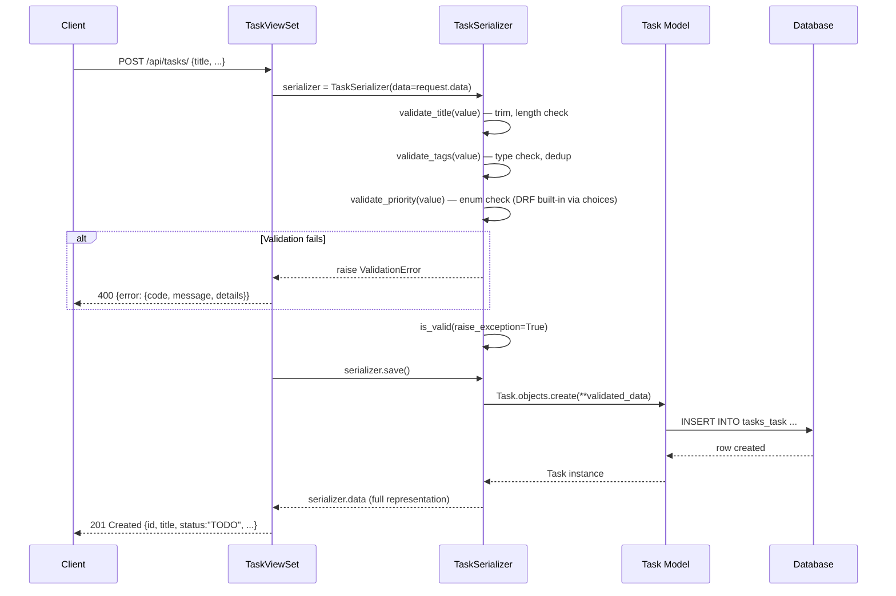
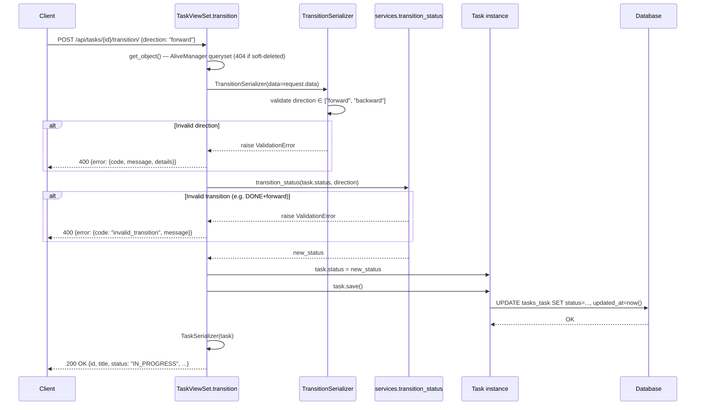
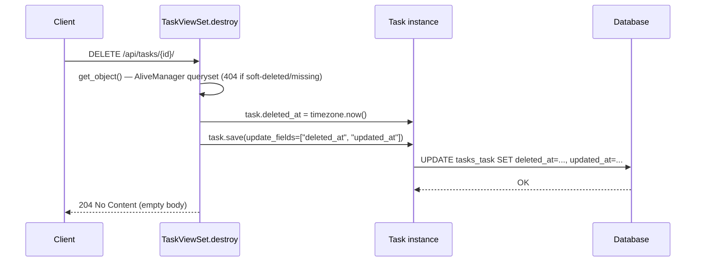

# Design — sprint1-mvp-tasks

**Change**: Sprint 1 MVP — Task Management Backend
**Status**: draft
**Date**: 2026-04-09
**Author**: SDD Design Agent

---

## 1. Architecture Overview

### 1.1 Component Diagram

```
repo-demo/
├── manage.py                        # Django entry point
├── requirements.txt                 # Python deps (django, drf, django-filter)
│
├── aitasks/                         # Django PROJECT package
│   ├── __init__.py
│   ├── settings.py                  # INSTALLED_APPS, REST_FRAMEWORK, etc.
│   ├── urls.py                      # Root urlconf → includes tasks.urls
│   ├── exceptions.py                # Custom DRF exception handler
│   └── wsgi.py
│
└── tasks/                           # Django APP package
    ├── __init__.py
    ├── models.py                    # Task model + choices constants
    ├── managers.py                  # AliveManager (default), unfiltered fallback
    ├── serializers.py               # TaskSerializer, TransitionSerializer
    ├── services.py                  # State machine pure function
    ├── views.py                     # TaskViewSet (CRUD + transition action)
    ├── filters.py                   # TaskFilter (django-filter FilterSet)
    ├── urls.py                      # DRF Router registration
    ├── admin.py                     # Basic ModelAdmin
    ├── apps.py                      # AppConfig
    ├── migrations/
    └── tests/
        ├── __init__.py
        ├── test_models.py
        ├── test_serializers.py
        ├── test_services.py
        └── test_views.py
```

### 1.2 Layer Separation

Request flow through the stack:

```
HTTP Request
    │
    ▼
aitasks/urls.py          ─── Root URL routing ("/api/tasks/" → tasks.urls)
    │
    ▼
tasks/urls.py            ─── DRF Router dispatches to ViewSet actions
    │
    ▼
tasks/views.py           ─── TaskViewSet: thin controller, delegates to serializer + service
    │
    ├──▶ tasks/serializers.py  ─── Validation (field-level), representation (read_only exclusions)
    │
    ├──▶ tasks/services.py     ─── Business logic (state machine transitions)
    │
    ├──▶ tasks/filters.py      ─── Query param filtering (status, priority)
    │
    ▼
tasks/managers.py        ─── AliveManager: default queryset excludes soft-deleted rows
    │
    ▼
tasks/models.py          ─── Task model: DB schema, indices, choices
    │
    ▼
SQLite (dev)
```

### 1.3 Sequence Diagrams

#### Create Task Flow



#### State Transition Flow



#### Soft Delete Flow



---

## 2. Module Design

### 2.1 models.py

```python
import uuid
from django.db import models
from tasks.managers import AliveManager

PRIORITY_CHOICES = [
    ("low", "Low"),
    ("medium", "Medium"),
    ("high", "High"),
]

STATUS_CHOICES = [
    ("TODO", "To Do"),
    ("IN_PROGRESS", "In Progress"),
    ("DONE", "Done"),
]


class Task(models.Model):
    id = models.UUIDField(
        primary_key=True,
        default=uuid.uuid4,
        editable=False,
    )
    title = models.CharField(max_length=200)
    description = models.TextField(blank=True, default="")
    priority = models.CharField(
        max_length=10,
        choices=PRIORITY_CHOICES,
        default="medium",
    )
    status = models.CharField(
        max_length=20,
        choices=STATUS_CHOICES,
        default="TODO",
    )
    due_date = models.DateField(null=True, blank=True)
    tags = models.JSONField(default=list, blank=True)
    created_at = models.DateTimeField(auto_now_add=True)
    updated_at = models.DateTimeField(auto_now=True)
    deleted_at = models.DateTimeField(null=True, blank=True)

    # Default manager filters out soft-deleted rows
    objects = AliveManager()
    # Escape hatch for admin / migrations / raw access
    all_objects = models.Manager()

    class Meta:
        ordering = ["-created_at"]
        indexes = [
            models.Index(fields=["created_at"]),
            models.Index(fields=["status"]),
            models.Index(fields=["priority"]),
            models.Index(fields=["deleted_at"]),
            models.Index(fields=["deleted_at", "created_at"]),
        ]

    def __str__(self):
        return self.title
```

**Design notes**:
- `ordering` in Meta ensures list endpoints return newest-first by default without explicit `.order_by()` in views.
- `all_objects` is declared AFTER `objects` — Django uses the first manager as `_default_manager`, so `AliveManager` takes that role.
- `editable=False` on `id` prevents it from appearing in ModelForm/Serializer generated fields.

### 2.2 managers.py

```python
from django.db import models


class AliveManager(models.Manager):
    """Default manager that excludes soft-deleted tasks."""

    def get_queryset(self):
        return super().get_queryset().filter(deleted_at__isnull=True)
```

**Design notes**:
- Minimal implementation. Overrides only `get_queryset()`.
- Every queryset obtained via `Task.objects` automatically excludes deleted rows — DRY.
- The ViewSet uses `Task.objects` by default (via `queryset = Task.objects.all()`), so soft-delete filtering is transparent.

### 2.3 serializers.py

```python
from rest_framework import serializers
from tasks.models import Task


class TaskSerializer(serializers.ModelSerializer):
    class Meta:
        model = Task
        fields = [
            "id", "title", "description", "priority", "status",
            "due_date", "tags", "created_at", "updated_at",
        ]
        read_only_fields = ["id", "status", "created_at", "updated_at"]

    def validate_title(self, value):
        """Trim whitespace, enforce 3-200 char length."""
        value = value.strip()
        if len(value) < 3:
            raise serializers.ValidationError(
                "Title must be at least 3 characters after trimming."
            )
        if len(value) > 200:
            raise serializers.ValidationError(
                "Title must not exceed 200 characters."
            )
        return value

    def validate_tags(self, value):
        """Ensure tags is a list of strings, deduplicate preserving order."""
        if not isinstance(value, list):
            raise serializers.ValidationError("Tags must be a list.")
        for tag in value:
            if not isinstance(tag, str):
                raise serializers.ValidationError(
                    "Each tag must be a string."
                )
        # Dedup preserving insertion order
        return list(dict.fromkeys(value))


class TransitionSerializer(serializers.Serializer):
    DIRECTION_CHOICES = [("forward", "Forward"), ("backward", "Backward")]

    direction = serializers.ChoiceField(choices=DIRECTION_CHOICES)
```

**Design notes**:
- `deleted_at` is excluded from `fields` entirely — never exposed via the API.
- `status` is `read_only` — silently ignored on create/update (DRF default behavior for read_only_fields). This resolves the ambiguity: no 400, just silent ignore (REQ-C-005, REQ-U-004).
- `id`, `created_at`, `updated_at` are `read_only` — PATCH with these fields silently ignores them (resolves REQ-U-003 ambiguity: silent ignore, not 400).
- `validate_title` performs trim BEFORE length check (REQ-V-007). The trimmed value is what gets saved.
- `validate_tags` uses `dict.fromkeys()` for dedup — preserves insertion order (resolves ambiguity from spec risks).
- `validate_priority` is NOT needed as a custom method — DRF's `ChoiceField` (auto-generated from model `choices`) handles enum validation natively.
- `TransitionSerializer` is a plain `Serializer` (not ModelSerializer) since it does not map to a model.

### 2.4 services.py

```python
from rest_framework.exceptions import ValidationError

# State machine matrix: (current_status, direction) → new_status
TRANSITION_MATRIX = {
    ("TODO", "forward"): "IN_PROGRESS",
    ("IN_PROGRESS", "forward"): "DONE",
    ("IN_PROGRESS", "backward"): "TODO",
    ("DONE", "backward"): "IN_PROGRESS",
}


def transition_status(current_status: str, direction: str) -> str:
    """
    Pure function: compute the new status given current status and direction.
    Raises ValidationError if the transition is not allowed.
    """
    key = (current_status, direction)
    new_status = TRANSITION_MATRIX.get(key)
    if new_status is None:
        raise ValidationError(
            {
                "direction": [
                    f"Cannot move '{direction}' from status '{current_status}'."
                ]
            },
            code="invalid_transition",
        )
    return new_status
```

**Design notes**:
- Pure function — no database access, no side effects. Takes strings in, returns a string or raises.
- `TRANSITION_MATRIX` as a dict constant makes the state machine explicit, exhaustive, and trivially testable.
- Raises `ValidationError` with `code="invalid_transition"` — the custom exception handler maps this to the `{"error": {"code": "invalid_transition", ...}}` envelope.
- The `ValidationError` includes a `details` dict keyed by `"direction"` so the error envelope matches the per-field format.

### 2.5 views.py

```python
from django.utils import timezone
from rest_framework import viewsets, status
from rest_framework.decorators import action
from rest_framework.pagination import PageNumberPagination
from rest_framework.response import Response
from django_filters.rest_framework import DjangoFilterBackend

from tasks.models import Task
from tasks.serializers import TaskSerializer, TransitionSerializer
from tasks.services import transition_status
from tasks.filters import TaskFilter


class TaskPagination(PageNumberPagination):
    page_size = 20
    page_size_query_param = "page_size"


class TaskViewSet(viewsets.ModelViewSet):
    queryset = Task.objects.all()   # AliveManager — soft-deleted excluded
    serializer_class = TaskSerializer
    pagination_class = TaskPagination
    filter_backends = [DjangoFilterBackend]
    filterset_class = TaskFilter
    http_method_names = ["get", "post", "patch", "delete", "head", "options"]

    def destroy(self, request, *args, **kwargs):
        """Soft delete: set deleted_at instead of physical deletion."""
        task = self.get_object()
        task.deleted_at = timezone.now()
        task.save(update_fields=["deleted_at", "updated_at"])
        return Response(status=status.HTTP_204_NO_CONTENT)

    @action(detail=True, methods=["post"], url_path="transition")
    def transition(self, request, pk=None):
        """Advance or revert the task status by one step."""
        task = self.get_object()
        serializer = TransitionSerializer(data=request.data)
        serializer.is_valid(raise_exception=True)
        direction = serializer.validated_data["direction"]

        new_status = transition_status(task.status, direction)
        task.status = new_status
        task.save(update_fields=["status", "updated_at"])

        return Response(TaskSerializer(task).data, status=status.HTTP_200_OK)
```

**Design notes**:
- `http_method_names` explicitly excludes PUT — only PATCH is supported for updates (partial update semantics as specified).
- `destroy()` overrides ModelViewSet's default to implement soft delete. Uses `update_fields` for efficiency and to ensure `updated_at` is refreshed.
- `transition()` uses `@action(detail=True)` which generates the URL `/api/tasks/{pk}/transition/`.
- `get_object()` in both `destroy` and `transition` uses the AliveManager queryset, so soft-deleted tasks return 404 automatically.
- The view is THIN: validation lives in serializers, business logic in services. The view only orchestrates.
- `save(update_fields=["status", "updated_at"])` — note that `auto_now=True` on `updated_at` still works with `update_fields` as long as `updated_at` is in the list.

### 2.6 filters.py

```python
import django_filters
from tasks.models import Task, STATUS_CHOICES, PRIORITY_CHOICES


class TaskFilter(django_filters.FilterSet):
    status = django_filters.ChoiceFilter(choices=STATUS_CHOICES)
    priority = django_filters.ChoiceFilter(choices=PRIORITY_CHOICES)

    class Meta:
        model = Task
        fields = ["status", "priority"]
```

**Design notes**:
- `ChoiceFilter` validates that the query param value is within the allowed choices. Invalid values trigger a validation error (REQ-F-002, REQ-F-003).
- Uses the same `STATUS_CHOICES` and `PRIORITY_CHOICES` constants from models — single source of truth.
- Filtering runs after the manager's soft-delete exclusion because the ViewSet's `queryset` is `Task.objects.all()` (AliveManager).

**Important**: By default, `django-filter` with `ChoiceFilter` does NOT return 400 for invalid values — it silently ignores them. To meet REQ-F-002/F-003 (invalid filter values return 400), we need `strict mode`. The `FilterSet` should set `strict = True` (or we configure `FILTERS_STRICTNESS` in settings). Implementation detail:

```python
class TaskFilter(django_filters.FilterSet):
    status = django_filters.ChoiceFilter(choices=STATUS_CHOICES)
    priority = django_filters.ChoiceFilter(choices=PRIORITY_CHOICES)

    class Meta:
        model = Task
        fields = ["status", "priority"]

    @property
    def qs(self):
        """Raise 400 if filter values are invalid."""
        if not self.is_valid():
            from rest_framework.exceptions import ValidationError
            raise ValidationError(self.errors)
        return super().qs
```

This overrides `qs` to check validity before returning the queryset, converting form errors into a DRF `ValidationError` that goes through the custom exception handler.

### 2.7 urls.py (tasks app)

```python
from django.urls import path, include
from rest_framework.routers import DefaultRouter
from tasks.views import TaskViewSet

router = DefaultRouter()
router.register(r"tasks", TaskViewSet, basename="task")

urlpatterns = [
    path("", include(router.urls)),
]
```

**Root urlconf** (`aitasks/urls.py`):

```python
from django.contrib import admin
from django.urls import path, include

urlpatterns = [
    path("admin/", admin.site.urls),
    path("api/", include("tasks.urls")),
]
```

This produces:
- `GET/POST /api/tasks/`
- `GET/PATCH/DELETE /api/tasks/{pk}/`
- `POST /api/tasks/{pk}/transition/`

### 2.8 exceptions.py (aitasks package)

```python
from rest_framework.views import exception_handler


def custom_exception_handler(exc, context):
    """
    Wraps all DRF error responses in the standard envelope:
    {"error": {"code": str, "message": str, "details": dict|None}}

    This handler does NOT add business logic — it only reshapes.
    """
    response = exception_handler(exc, context)
    if response is None:
        return None

    # Determine error code
    code = getattr(exc, "default_code", "error")
    if hasattr(exc, "detail"):
        detail = exc.detail
    else:
        detail = str(exc)

    # Build envelope
    if isinstance(detail, dict):
        # Field-level errors from ValidationError
        message = "Validation failed."
        details = {
            field: (msgs if isinstance(msgs, list) else [str(msgs)])
            for field, msgs in detail.items()
        }
        # Check for custom code in the ValidationError
        if hasattr(exc, "get_codes"):
            codes = exc.get_codes()
            if isinstance(codes, dict):
                for field_codes in codes.values():
                    if isinstance(field_codes, list):
                        for c in field_codes:
                            if c == "invalid_transition":
                                code = "invalid_transition"
                                break
    elif isinstance(detail, list):
        message = " ".join(str(item) for item in detail)
        details = None
    else:
        message = str(detail)
        details = None

    # Map DRF default codes to our API codes
    code_map = {
        "not_found": "not_found",
        "invalid": "validation_error",
        "required": "validation_error",
        "parse_error": "validation_error",
    }
    if code not in ("invalid_transition",):
        code = code_map.get(code, "validation_error")

    envelope = {
        "error": {
            "code": code,
            "message": message,
        }
    }
    if details:
        envelope["error"]["details"] = details

    response.data = envelope
    return response
```

**Design notes**:
- Calls DRF's default `exception_handler` first — inherits all built-in behavior (content negotiation, status codes, throttle headers).
- Only reshapes the response data into the `{"error": {...}}` envelope. Zero business logic.
- Maps DRF's internal codes (`not_found`, `invalid`, etc.) to the API-specified codes (`not_found`, `validation_error`, `invalid_transition`).
- `invalid_transition` is a special code set by `services.transition_status` — detected and preserved.

---

## 3. Settings Configuration

### aitasks/settings.py additions

```python
INSTALLED_APPS = [
    "django.contrib.admin",
    "django.contrib.auth",
    "django.contrib.contenttypes",
    "django.contrib.sessions",
    "django.contrib.messages",
    "django.contrib.staticfiles",
    # Third-party
    "rest_framework",
    "django_filters",
    # Local
    "tasks",
]

DEFAULT_AUTO_FIELD = "django.db.models.BigAutoField"

REST_FRAMEWORK = {
    "DEFAULT_PAGINATION_CLASS": None,  # Set per-view (TaskPagination on ViewSet)
    "DEFAULT_FILTER_BACKENDS": [
        "django_filters.rest_framework.DjangoFilterBackend",
    ],
    "EXCEPTION_HANDLER": "aitasks.exceptions.custom_exception_handler",
}
```

**Design notes**:
- Pagination is set at the ViewSet level (`pagination_class = TaskPagination`), not globally. This avoids unintended pagination on future endpoints that may not need it.
- `DEFAULT_FILTER_BACKENDS` is set globally as a convenience, but the ViewSet also declares it explicitly for clarity.
- `EXCEPTION_HANDLER` points to our custom handler — all DRF error responses go through it.
- `DEFAULT_AUTO_FIELD` is standard Django 5.x boilerplate.

---

## 4. Key Design Decisions

### ADR-001: read_only_fields for immutable fields (silent ignore, not 400)

**Decision**: Use DRF's `read_only_fields` for `id`, `status`, `created_at`, `updated_at`. PATCH requests including these fields silently ignore them.

**Rationale**:
- DRF's default behavior for `read_only_fields` is to strip them from input — the value is simply not applied.
- Returning 400 would be overly strict for a PATCH endpoint where clients may send the full object back.
- This is the idiomatic DRF approach and the path of least surprise for API consumers.
- The spec (REQ-U-003) explicitly allows either silent ignore or 400 — we choose silent ignore.

**Tradeoff**: Clients sending `status` in a PATCH body get no indication it was ignored. This is acceptable because the transition endpoint is the documented way to change status.

### ADR-002: services.py for state machine (testability + separation)

**Decision**: State transition logic lives in `tasks/services.py` as a pure function, not in the model or view.

**Rationale**:
- **Testability**: A pure function `transition_status(current, direction) -> new` can be tested with no database, no HTTP, no fixtures. Table-driven tests cover all 6 matrix cells in seconds.
- **Separation of concerns**: The view handles HTTP (request parsing, response building). The service handles business rules. Neither knows about the other's internals.
- **Reusability**: If a future management command or Celery task needs to transition status, it calls the same function.
- **Spec compliance**: REQ-T-008 explicitly requires this separation.

**Tradeoff**: One extra import in the view. Negligible cost.

### ADR-003: Custom manager as default (DRY soft-delete filtering)

**Decision**: `AliveManager` is the default manager (`objects`), so `Task.objects.all()` never returns soft-deleted rows.

**Rationale**:
- Every query path (list, detail, update, transition) needs to exclude soft-deleted tasks. Doing this at the manager level means we write the filter ONCE instead of in every view method.
- The ViewSet's `queryset = Task.objects.all()` automatically excludes deleted rows — no room for developer error.
- `all_objects` provides an explicit escape hatch when you genuinely need all rows (admin, data exports, debugging).

**Tradeoff**: Django admin and migrations use `_default_manager`. Since admin is registered with the default manager, soft-deleted tasks won't appear in admin either. If admin access to deleted tasks is needed, register with `Task.all_objects` in `admin.py`. For Sprint 1 (no admin requirements), this is fine.

### ADR-004: Exception handler — thin reshaping only

**Decision**: The custom exception handler only reshapes DRF's error response into the `{"error": {...}}` envelope. It adds ZERO business logic.

**Rationale**:
- Business logic in an exception handler is an anti-pattern — it makes error behavior unpredictable and hard to test.
- The handler's single responsibility: take DRF's response, reformat it, return it.
- Error codes (`invalid_transition`, `validation_error`, `not_found`) are set by the code that raises the exception, not by the handler.
- Spec compliance: REQ-E-006 explicitly requires no business logic in the handler.

### ADR-005: Tags deduplication with dict.fromkeys()

**Decision**: Use `list(dict.fromkeys(value))` for tag deduplication in the serializer.

**Rationale**:
- Preserves insertion order (Python 3.7+ dict ordering guarantee).
- The spec says "order may vary" but preserving order is strictly better — no user surprise.
- More efficient than `list(set(value))` for small lists AND preserves order.
- Spec risk explicitly flagged this as needing a decision — resolved here.

---

## 5. Ambiguity Resolutions

| Ambiguity (from spec) | Resolution | Justification |
|---|---|---|
| PATCH with immutable fields (`id`, `created_at`) — 400 or silent ignore? | **Silent ignore** via `read_only_fields` | DRF idiomatic; spec allows both; less friction for clients |
| Status in POST body — 400 or silent ignore? | **Silent ignore** via `read_only_fields` | Same as above; status always starts as `TODO` |
| Tags dedup order — preserved or arbitrary? | **Preserved** via `dict.fromkeys()` | Strictly better; spec allows "order may vary" but preservation costs nothing |
| `deleted_at` in API response? | **Excluded** from serializer `fields` entirely | Spec says MUST NOT include; not even present as `null` |
| Invalid filter values — 400 or silently ignored? | **400** via custom `qs` property on FilterSet | Spec says SHOULD return 400; explicit errors are better DX |
| `auto_now` with `update_fields` | Include `"updated_at"` in `update_fields` list | Django updates `auto_now` fields only when they are in `update_fields` (or when `update_fields` is `None`). We must include it explicitly. |

---

## 6. Risks

| Risk | Likelihood | Impact | Mitigation |
|---|---|---|---|
| `ChoiceFilter` strict mode requires custom `qs` override — could miss edge cases | Medium | Low | Test with invalid filter values explicitly (Scenario F-05, F-06) |
| `auto_now` + `update_fields` interaction is a known Django gotcha | High | Medium | Always include `updated_at` in `update_fields`; test that `updated_at` changes on soft delete and transition |
| Custom exception handler may not cover all DRF exception types (throttling, auth in future sprints) | Low | Low | Handler delegates to DRF's built-in handler first; only reshapes what comes back. Future exception types will pass through. |
| SQLite `JSONField` has limited query capabilities (no `__contains` lookup) | Low | Low | Sprint 1 does not filter by tags. If needed later, migrate to PostgreSQL. |
| Manager ordering in model affects admin/migrations | Low | Low | `AliveManager` is intentionally first. Document `all_objects` for admin use if needed. |
